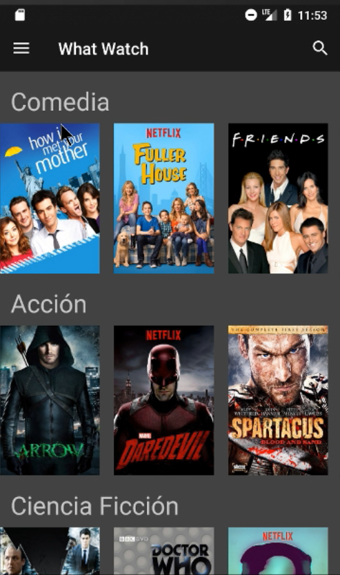
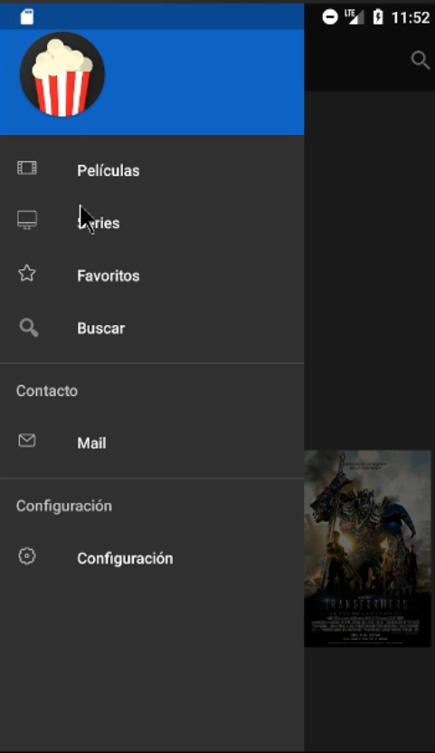
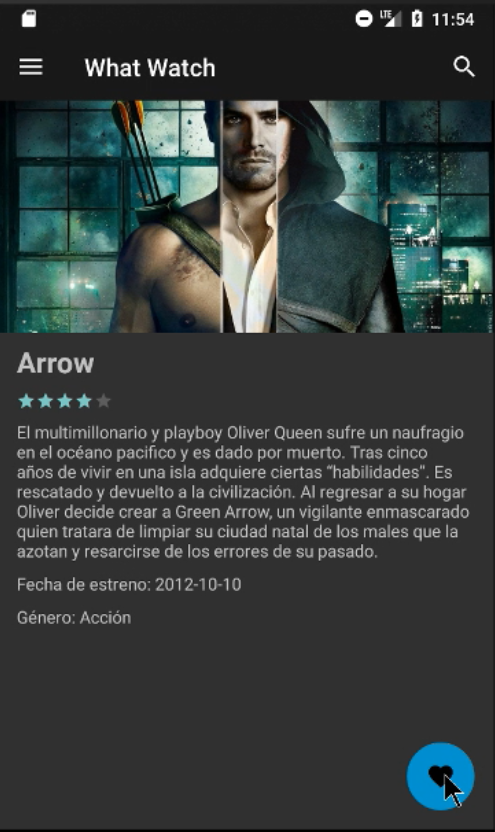
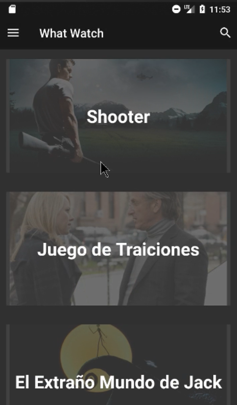
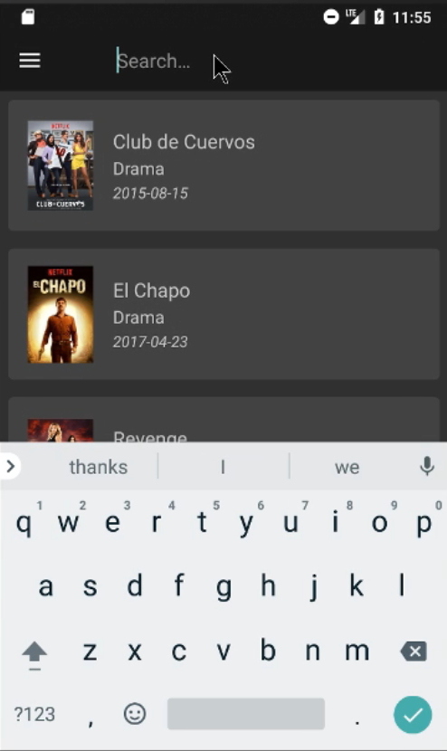

# WhatWhatch-Android

WhatWhatch for Android was a simple buy yet complete application that I developed with [@nakir](https://github.com/Nakyr) when we were at a movile development course.

Some features included 
 - Webservice usage
 - SQLite usage
 - User preferences usage
 - Incremental search

It currently doesnot work since I powered of the backend database, but I will work over it when I got some free time.

TODO:
- [ ] Making the app great again

